# 🏗️ AI-Enhanced DevSecOps Pipeline - Architecture & Workflow

## Overview

This document provides visual representations of the system architecture, data flow, and component interactions.

---

## 🎯 System Architecture

### High-Level Architecture

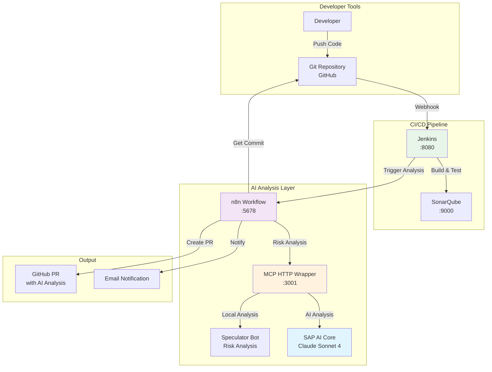

---

## 🔄 Detailed Workflow Sequence

### Complete Pipeline Flow

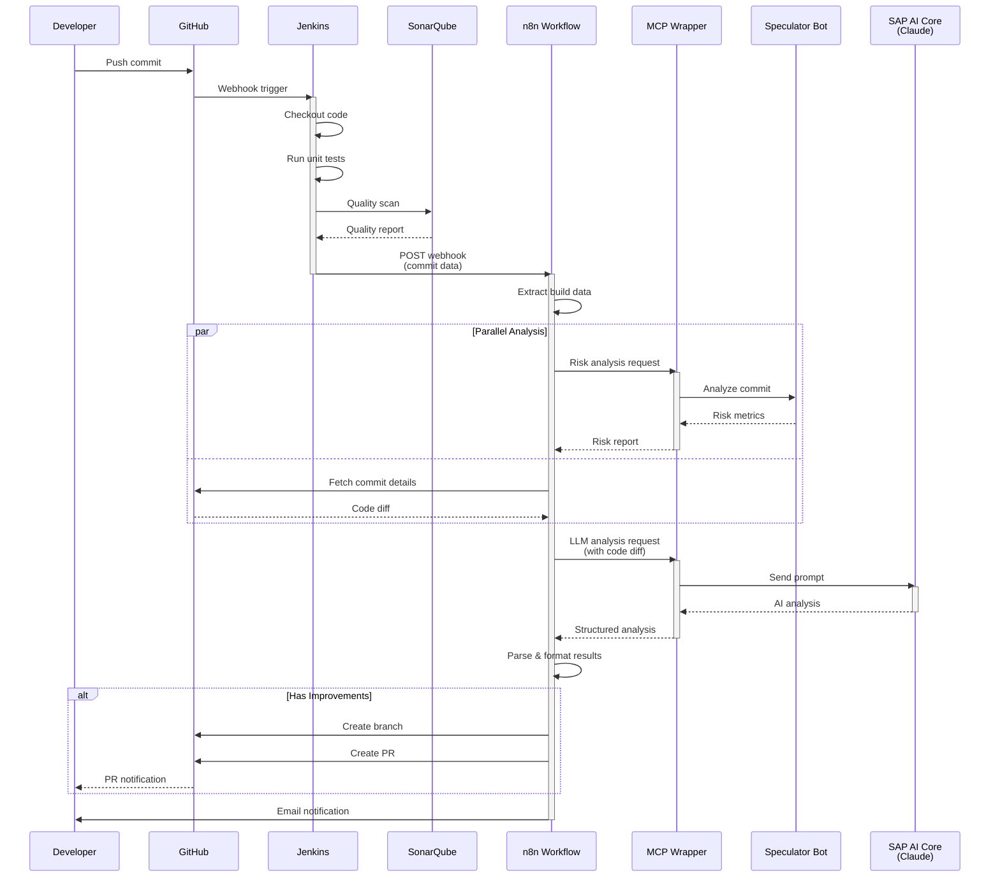

---

## 🏛️ Component Architecture

### MCP Server Architecture

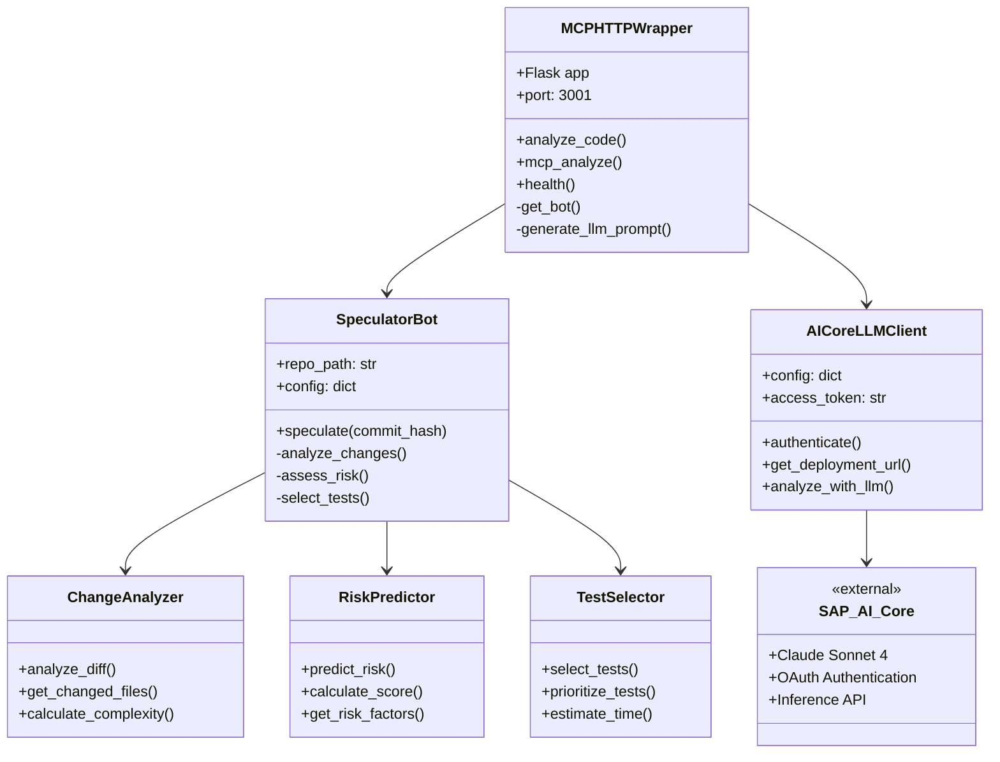

---

## 📊 Data Flow Architecture

### Information Flow Through Pipeline

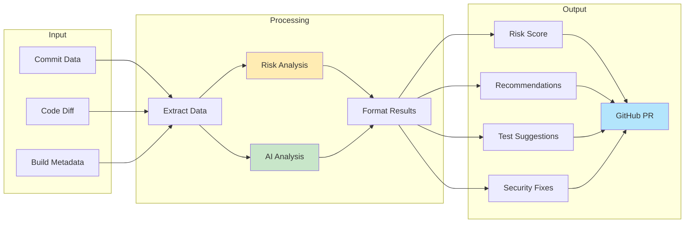

---

## 🔌 Integration Points

### External System Connections

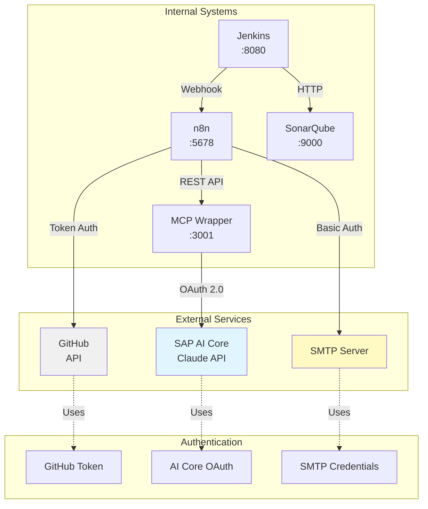

---

## 🧩 n8n Workflow Architecture

### Workflow Node Structure

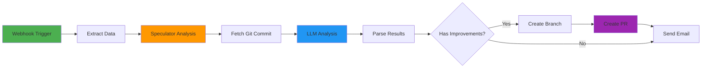

---

## 🔐 Security & Authentication Flow

### Authentication Architecture

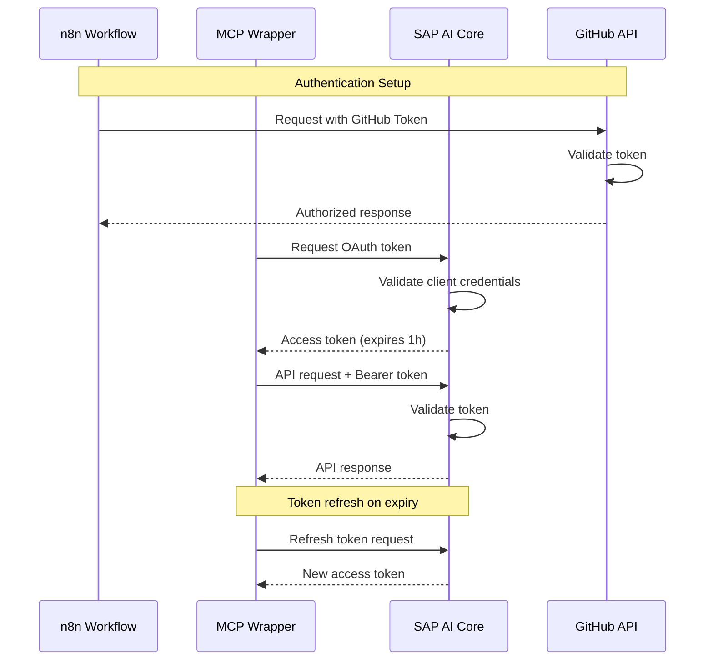

---

## 📦 Deployment Architecture

### Production Deployment (SAP BTP)

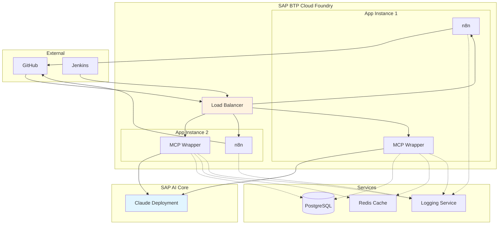

---

## 🔄 State Machine

### Workflow Execution States

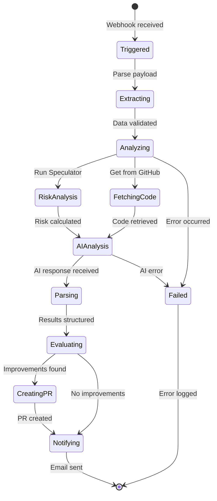

---

## 🧪 Testing Flow

### Test Execution Path

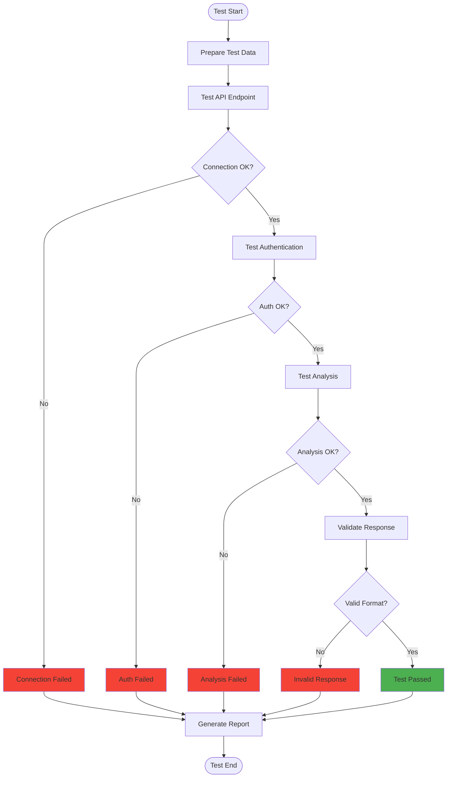

---

## 📈 Performance & Monitoring

### System Monitoring Points

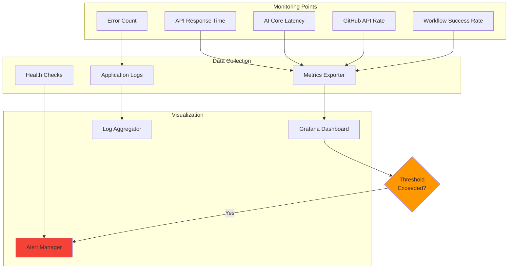

---

## 🗄️ Data Models

### Core Data Structures

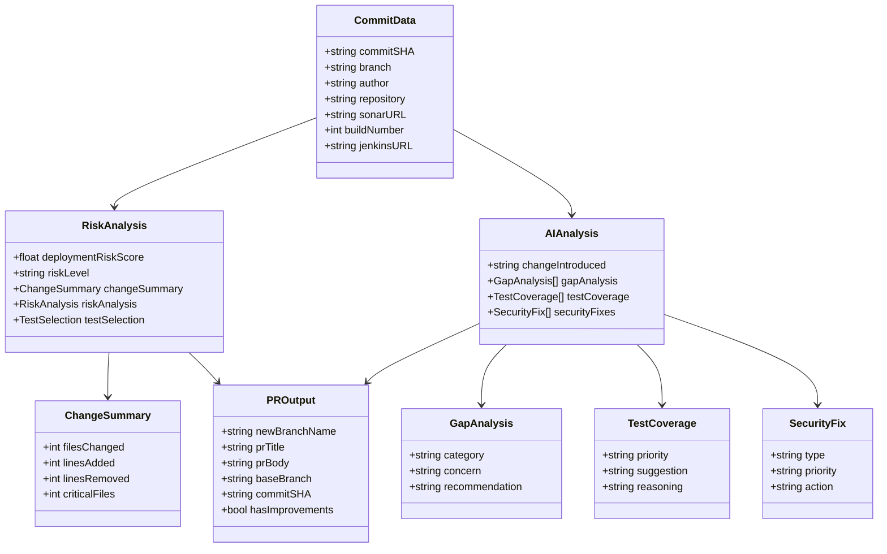

---

## 🌐 Network Architecture

### Port and Protocol Map

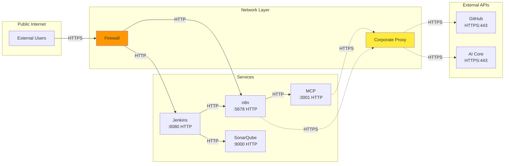

---

## 📝 Summary

### Key Architecture Patterns

1. **Microservices**: Each component (Jenkins, n8n, MCP, SonarQube) is independently deployable
2. **Event-Driven**: Webhook-based triggers drive the workflow
3. **API Gateway**: n8n acts as orchestrator for all services
4. **Separation of Concerns**: Analysis, AI, and automation are separated
5. **Scalability**: Can scale horizontally on SAP BTP
6. **Security**: OAuth 2.0 and token-based authentication throughout

### Technology Stack

- **CI/CD**: Jenkins, Git
- **Orchestration**: n8n
- **Analysis**: Python (Speculator Bot)
- **AI**: SAP AI Core (Claude Sonnet 4)
- **Quality**: SonarQube
- **Container**: Docker
- **Cloud**: SAP BTP (Cloud Foundry / Kyma)

---

**All diagrams are in Mermaid format and can be viewed in:**
- GitHub (native support)
- VS Code (with Mermaid extension)
- Mermaid Live Editor: https://mermaid.live

